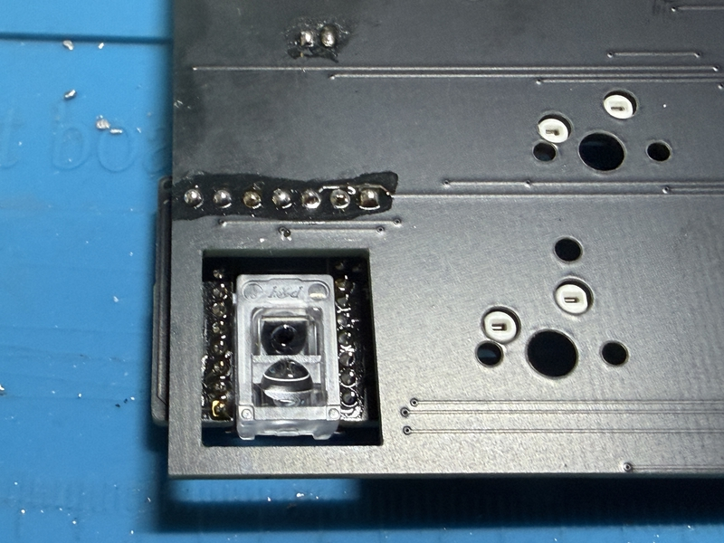
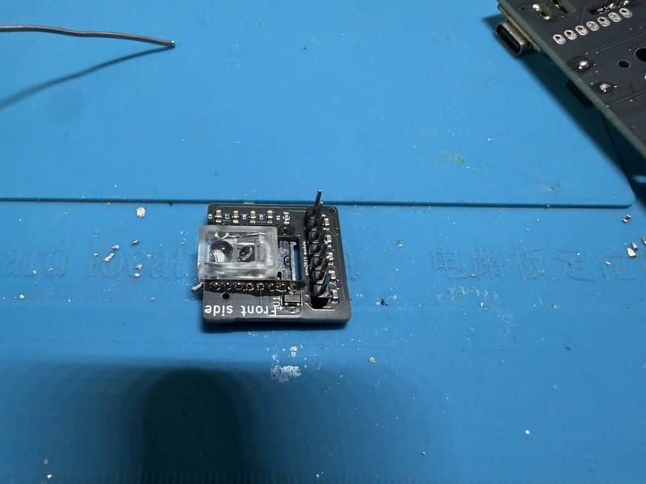
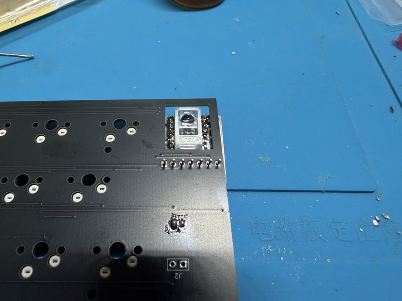
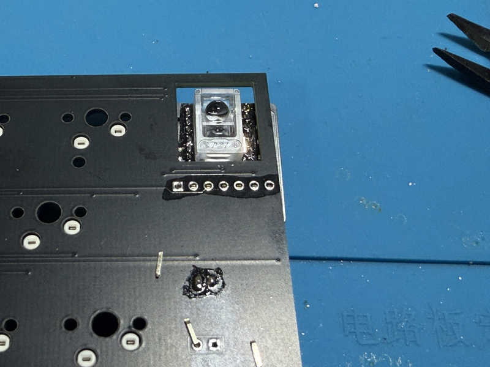
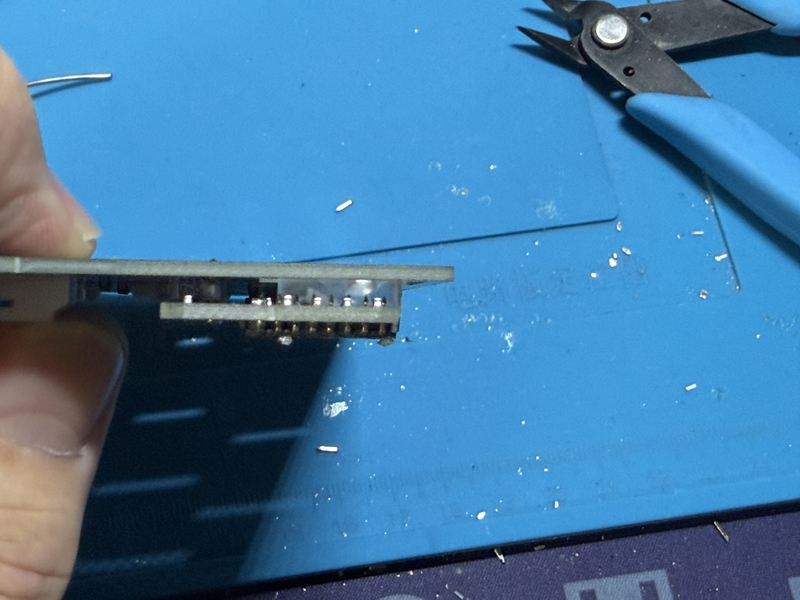

# ビルドガイド

注意：日本語だけです。
 

## 1 基板の向きについて

左右の基板について、「cool936tb2」と印刷がある方が裏面となります。
 
トラックボール基板（以下、「トラボ基板」）は、「Back side」と書かれた方が裏面です。
 
 

## 2 ダイオードのはんだ付け

SMDダイオードが最適です。
 
ダイオードには向きがあります。
 
PCBA（工場ではんだ付け済み）されているので、実際ははんだ付け不要です。
 
 

## 3 スイッチソケットのはんだ付け

choc modelは、chocのスイッチソケットを36個用意してはんだ付けをしてください。
 
cherry MX modelは、PCBAされているので、はんだ付け不要です。
 
 

## 4 xiao bleのはんだ付け

このキーボードの最難関なところです。
 
次の動画を見ながら、頑張ってください。
 

https://youtu.be/98yqLjzfdl4

xiao bleは、左右の基板の裏面にはんだ付けします。
 

## 5 トラボ基板のはんだ付け

トラボ基板の「Back side」と書かれた方から、PMW3610センサーを差し込みます。
 
「Front side」側に出た端子をはんだ付けします。
 
 

## 6　リセットスイッチのはんだ付け

リセットスイッチを左右の基板の裏面から差し込みます。
 
基板の表面に出た端子をはんだ付けします。
 
次の動画を参考にしてください。

https://youtu.be/Pl24Exfh8b8

 
 

## 7 スライドスイッチのはんだ付け

スライドスイッチを左右の基板の裏面から差し込みます。
 
基板の表面に出た端子をはんだ付けします。
 
次の動画を参考にしてください。

https://youtu.be/5nkRklibay4

 
 

## 8 トラボ基板のはんだ付け

う〜ん、動画のストックがないなぁ。

 
７ピンに長さを調整したピンヘッダを、トラボ基板の「Front side」と書かれた表面から差し込みます。

裏面に出たピンをはんだ付けします。
 
「Front side」と書かれた面に出ているピンヘッダを、右の基板の裏面に差し込みます。

出過ぎたピンはニッパーなどで切り取ってください。その後、はんだ付けをします。

横から見て、トラボ基板と右の基板が平行になるように、はんだ付けをしてください。

 
 

## 9 電池ケースの接続

JSTコネクター（オス・メス）を使う方法もあります。
 
ただし、部品数が増えるため、BOMには載せていません。
 
ここでは、電池ケースの赤と黒のケーブルを左右の基板に直にハンダで固定する方法です。
 
赤ケーブルは、BAT+に、黒ケーブルは、GNDと左右の基板の裏面に書かれたスルーホール（穴）に差し込んでください。
 
表面に出た部分をはんだ付けします。
 
電池の逆向きに入れたり、ケーブルの色を間違えて半田付けすると、xiao bleが壊れる可能性があります。
 
また、電池ケースに電池を入れた後、スライドスイッチのオンオフに関係なく、xiao bleが発熱した時は、すぐに電池を取り外してください。
 
原因として、xiao bleのはんだ付けのミスが考えられます。
 
左右の基板の表面からxiao bleを対して、三つの間口があります。その真ん中の間口のはんだ付けがミスしているでしょう。
 
ルーペで確認して、BAT+とBAT-がハンダでブリッジ（つながっている状態）していないか、確認してください。
 
 

## 10 トラックボールユニットの組み立て

右のスイッチプレートにある、トラックボール部分に、上面から内側の窪みに、ベアリングを挿入します。
  
次に、側面から、M2ねじ6mmで固定します。これを３箇所を行ってください。
 
その後、上面から、12mm球を軽い力で押し込みます。もし、取り出す時は、下面から押し出してください。
 
 

## 11　動作確認

スイッチプレートやロータリーエンコダーを装着する前ですが、一度、全てのスイッチソケットのはんだ付けに問題がないか、確認します。
 
全てのスイッチソケットにキースイッチを差し込んでください。
 
左右の基板にはんだ付けしたxiao bleに、firmwareをドラッグ&ドロップしてください。
 
次に電池ケースに単４電池を装着してください。
 
左、右の順でスライドスイッチを手前に動かすと電源が入ります。
 
お手元のPCやタブレットなどにBT接続して、キー入力が問題なくできるか、確認してください。
 
ここで、キー入力が正しく反応しない場合、xiao bleのはんだ付けのミスまたは、ダイオードやスイッチソケットのはんだ付けミス、単純にスイッチソケットに差し込んだキースイッチの端子が曲がっていて、正しく刺さっていない可能性があります。
 
動作確認に問題がなければ、キースッチをスイッチソケットから外してください。
 
 

## 12　ロータリーエンコーダの取り付け

自作キーボードに使用される頻度がある、垂直型のロータリーエンコーダを左の基板に取り付けできます。
 
ただし、スイッチプレートの形状が合わない場合、ご自身で加工する必要があります。
 
 
cherry MX modelでは、水平型のロータリーエンコーダの取り付けを推奨しています。
 
遊舎工房で販売されている[CKW12](https://shop.yushakobo.jp/products/ckw12?shop_sign_in=true&variant=51526931153127)が使用できます。
 
または、m.ki設計の互換品も取り付け可能です。
 
水平型ロータリーエンコーダについては、左のスイッチプレートを左の基板に乗せてから、差し込みます。
 
基板の裏面に出た端子をはんだ付けしてください。
 
この後、ロータリーエンコーダの動作確認をしてください。
 

## 13 スイッチプレートの組み立て

左右の基板に対して、左右のスイッチプレートを上面に乗せます。
 
上面からM2ねじを差し込んで、基板の裏面にM2スペーサーで固定してください。
 
 

## 14 ボトムケースの組み立て

左右のボトムケース内部に、電源スイッチノブを装着します。
 
13で組み立てた左右の基板等を、ボトムケースに収めます。
 
ケースに収める際、基板のスライドスイッチが、電源スイッチの部の凹部に入れるように注意してください。
 
電池ケースをボトムケースの奥側に収められるようして、左右の基板等で蓋をしてください。
 
ボトムケースの下面から、M2ネジを差し込み、固定してください。
 
左右のボトムケースが向かい合う側面には、厚み2.5mm、直径6mmの丸型磁石が入る凹部があります。
 
磁石を入れることで、左右のケースを一体型のように固定できます。
 
 

## 15　キーキャップの装着

お好みのキーキャップを装着してください。
 
下記のサイトは、オリジナルのキーキャップを作れるYUZU Custom Keycapsにおける、キーキャップセットです。
 

https://yuzukeycaps.com/ja/c/1da72466-d7d6-40e2-adac-48b55c5aeff5

 
これで完成です。
 
 

